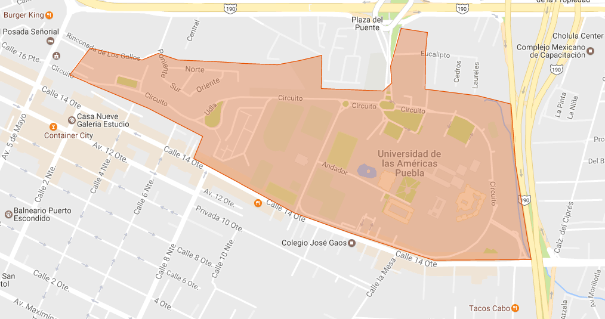

Collection samples
==================

Import collections into your MongoDB with the command:

```sh
$ mongoimport --db <dbName> --collection <collectionName> --file <fileName>.json --jsonArray
```

> In all samples, the users collection passwords are not set.

# [Universidad de las Américas Puebla](https://goo.gl/maps/AoY4jdXEvwz)

Mapped area


